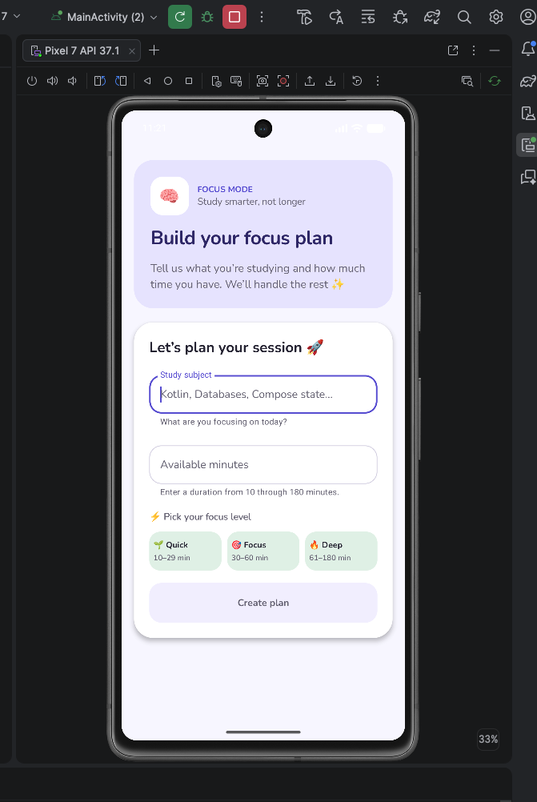

# Focus Plan Builder

**Name:** Priya Dilip Bajaria  
**BUID:** U08184333  
**Assignment:** Focus Plan Builder

## Description

Focus Plan Builder is a single-screen Android application that helps students create a focused study plan. The user enters a subject and available study time. After validating the input, the app displays the cleaned subject, duration, session category, recommended break, and a complete summary message. The interface is built with Kotlin, Jetpack Compose, and Material 3.

## How to Run

1. Clone or download this repository.
2. Open the `Focus_Plan_Builder` folder in Android Studio.
3. Allow Gradle to sync.
4. Start a phone emulator or connect an Android device.
5. Select the `app` configuration and click **Run**.

## Screenshot

## State and Recomposition

`FocusPlanRoute` owns the application state. It stores the subject, duration text, and generated plan, validates the inputs, and passes values and callbacks to `FocusPlanScreen`.

The text-field values are stored as `String` because text fields receive text while the user is typing. This allows the duration field to temporarily contain blank, incomplete, or invalid input. `toIntOrNull()` is safer than `toInt()` because it returns `null` when conversion fails instead of throwing an exception.

The Create plan button’s enabled state is derived from the current subject and duration. When either input changes, Compose observes the state update and recomposes the affected interface. This automatically updates the button’s enabled state. Changing either input also removes the old result.

`rememberSaveable` preserves the subject and duration after Activity recreation, such as device rotation. Regular local variables would be recreated and lose their values.

## Generative AI Assistance

Generative AI was used for guidance with Compose organization, UI refinement, debugging, test cases, and README wording. I reviewed, understood, tested, and adjusted the final implementation.